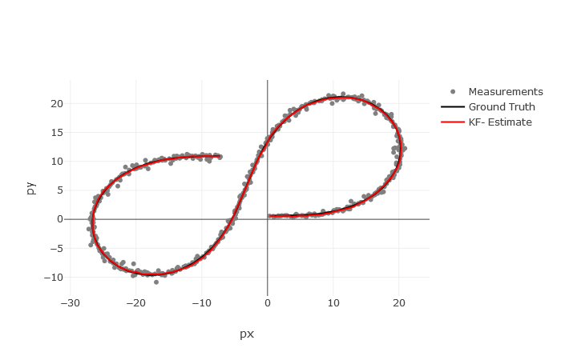
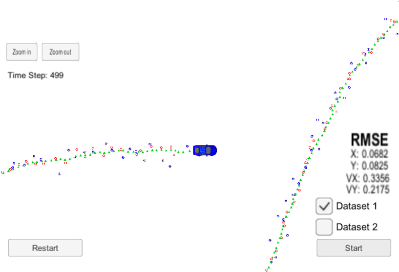
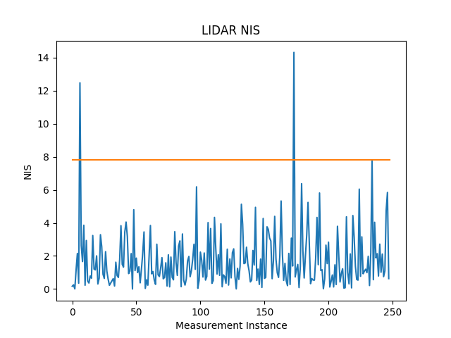
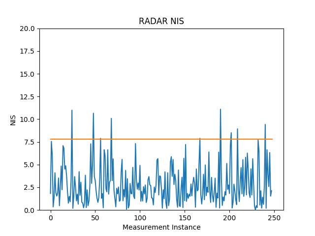

# Unscented Kalman Filter 

In this project I have utilized Unscented kalman filter algorithm to estimate the state of a moving object of interest with noisy lidar and radar measurements. The main goal of the project is to apply Unscented Kalman Filter to fuse data from LIDAR and Radar sensors of a self driving car using C++.

This project uses implementation of UKF on a CTRV (Constant Turn Rate and Velocity) process model for object tracking. The UKF is a powerful technique for performing recursive nonlinear estimations. Compared to Extended Kalman filter, UKF uses a derivative-free approach. UKF is also more accurate than the Extended Kalman Filter and has an equivalent computational complexity.

Detailed explanation and the math behind UKF is explained [here](https://www.pdx.edu/biomedical-signal-processing-lab/sites/www.pdx.edu.biomedical-signal-processing-lab/files/ukf.wan_.chapt7_.pdf)

## Contents of this Repository

* `src` - Directory for project source code
   * `main.cpp` - Entry point for the Unscented Kalman Filter reads in data, calls a function to run the Kalman filter, calls a function                   to calculate RMSE.
   * `UKF.cpp` - Defines the predict function, the update function for lidar, and the update function for radar. Initializes the filter,                  calls the predict function, calls the update function.
   * `tools.cpp` - Contains code to calculate RMSE
   * `data` - Contains one input file with provided by Udactity and one output file generated by the program
* `nis_visualizeer` - Directory with NIS data for Lidar, Radar and a helper python program to visualize NIS data.

## Dependencies & Environment

* cmake >= 3.5
 * All OSes: [click here for installation instructions](https://cmake.org/install/)
* make >= 4.1
  * Linux: make is installed by default on most Linux distros
  * Mac: [install Xcode command line tools to get make](https://developer.apple.com/xcode/features/)
  * Windows: [Click here for installation instructions](http://gnuwin32.sourceforge.net/packages/make.htm)
* gcc/g++ >= 5.4
  * Linux: gcc / g++ is installed by default on most Linux distros
  * Mac: same deal as make - [install Xcode command line tools]((https://developer.apple.com/xcode/features/)
  * Windows: recommend using [MinGW](http://www.mingw.org/)
* [Eigen library](src/Eigen)

## How to run the code

1. Clone this repo.
2. Make a build directory: `mkdir build && cd build`
3. Compile: `cmake .. && make` 
   * On windows, you may need to run: `cmake .. -G "Unix Makefiles" && make`
4. Run it by either of the following commands: 
   * `./UnscentedKF ../data/obj_pose-laser-radar-synthetic-input.txt`

## Kalman filter general steps and data flow

All Kalman filters have three steps 

1. Initialization
2. Prediction
3. Update

A standard Kalman filter can only handle linear equations. Both the Extended Kalman Filter (EKF) and the Unscented Kalman Filter (UKF) allows you to use non-linear equations. The difference between EKF and UKF is how they handle non-linear equations. Extended Kalman Filter uses the Jacobian matrix to linearize non-linear functions. Unscented Kalman Filter on the other hand, does not need to linearize non-linear functions, instead the unscented Kalman filter takes representative points from a Gaussian distribution.

# Results

The results were visualized with [Sensor Fusion utilities](https://github.com/udacity/CarND-Mercedes-SF-Utilities).

## Visualisation

The following graph compares real and estimated values for car coordinates using data provided by Udacity

## RMSE

The accuracy requirement is that the algortihm should perform with RMSE error lower than some threshold values. This shown in table below:

| Parameter | RMSE | RMSE threshold |
|:---------:|:----:|:--------------:|
|Px         |0.0682| 0.09           |
|Py         |0.0825| 0.10           |
|Vx         |0.3356| 0.40           |
|Vy         |0.2175| 0.30           |

The RMSE for same dataset running Extended Kalman Filter (EKF) are as follows:

| Parameter | RMSE | RMSE threshold |
|:---------:|:----:|:--------------:|
|Px         |0.0973| 0.11           |
|Py         |0.0854| 0.11           |
|Vx         |0.4512| 0.52           |
|Vy         |0.4399| 0.52           |

## NIS

NIS (normalized innovation squared) was used for optimizing the noise parameters. NIS of liadar and radar measurements visualized: 

